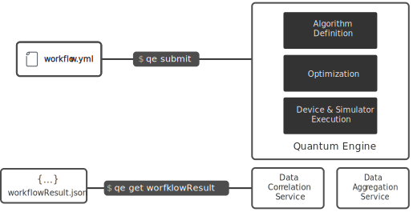

Orquestra is dedicated to making writing and deploying workflows simple, shareable, and scalable to meet the needs of scientists and developers. It encourages an incremental approach that allows for swappable simulators and hardware backends, enabling collaboration to utilize best-of-breed quantum systems.

Orquestra can be used as a new layer in your stack that sits between your infrastructure and your applications. It's a combination of open source components, commercial extensions, and cloud services.

## The Components of Orquestra

The figure below shows the major components of Orquestra and how they work together. Workflows are your inputs to the Quantum Engine, which then uses your workflows to run your experiments, producing results that can be processed further or directly plotted.

### Workflows

Your workflow is a description of the different steps required to get the desired experiment's results. The Quantum Engine kicks into gear, spinning up machines, fetching required resources, and executing steps in your workflow until successful completion. Please see the following tutorials that demonstrate quantum experiments in Orquestra:

- [Bond Length Estimation of H2](../tutorial/hydrogen-vqe)
- [Solving the Max-Cut Problem](../tutorial/maxcut-qaoa)

### Quantum Engine

Quantum computing is a very fast-moving field. The ability to incorporate the newest algorithms into an existing workflow relies on how well the orchestration is done by the Quantum Engine. Orquestra gives you the capability to swap different sections of your workflows, run them in parallel, and compare results, allowing quicker research and product development.

### Data management

Quantum experiments produce vast amounts of data, quickly exposing some of the limitations of current database management systems. Orquestra seamlessly handles the management of your data across different sources, producing at the end a single data file which you can use for analysis.
