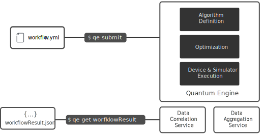

Orquestra is dedicated to making deployments of quantum workflows designed for the needs of scientists and developers simple, portable and scalable. It encourages an agile, incremental approach while enabling collaboration to utilize best-of-breed quantum systems. Orquestra puts particular emphasis on tooling and workflows.

Orquestra is best used as a new layer in your stack that sits between your infrastructure and your applications. It's a combination of open source components, commercial extensions, and cloud services.

## Orquestra Components

## Workflows

With these components, Orquestra  orchestrates workflows. Each of these workflows makes use of several different parts of the platform, working together. Some examples are:

- [Bond Length Estimation of H2](../tutorial/hydrogen-vqe)
- [Solving the Max-Cut Problem](../tutorial/maxcut-qaoa)
