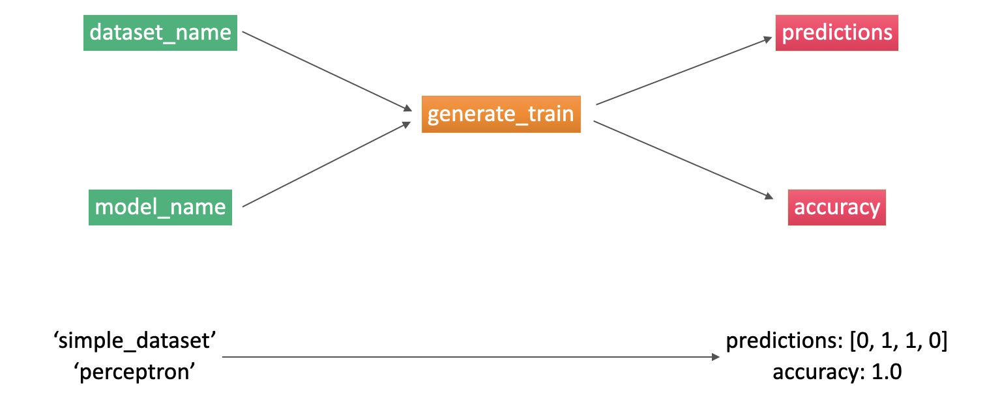

FEEDBACK: CALL THE WORKFLOW TUTORIAL-2
FEEDBACK: EXPLAIN DIFFERENCE BETWEEN UTILS AND FUNCTIONS

# Tutorial 2: Building an Orquestra workflow

Watch the [video](https://www.youtube.com/watch?v=EDjFA5Wtl5o) describing this tutorial.


In Tutorial 1 you learned to run a workflow which ran an existing task that trained a machine learning model. In this tutorial you'll learn how to build the task.

Recall that in Tutorial 1, we built a workflow template that ran a function called `generate_train_predict`, which generates a dataset, trains a machine learning model on it, and then outputs the predictions and the accuracy of the model on that same dataset.



The code to run this function locally is below. Our goal is to turn this code into Orquestra, to be able to run it with the workflow template from Tutorial 1.

### 1. The code
Here is the code that we have in our machine, that we intend to run in Orquestra. There are two files, one is called `main.py` which contains the main function `generate_train_predict`, and the other one is called `functions.py`, which contains the helper functions.

The `generate_train_predict` function does the following:
- Generates the data based on the dataset name we input.
- Preprocesses the data by splitting it into features and labels.
- Trains a model on this data, based on the model name we input.
- Makes predictions on the existing dataset using the model.
- Calculates the accuracy of the model.
- Outputs the predictions and the accuracy.
#### `main.py`
```python
from functions import *

def generate_train_predict(dataset_name, model_name):
    # Generates the data
    data = generate_dataset(dataset_name)

    # Processes the data
    features, labels = preprocess_data(data)
    
    # Trains the model
    model = train_model(features, labels, model_name)
    
    # Makes predictions
    predictions = make_predictions(model, features)
    
    # Calculates the accuracy of the model
    accuracy = calculate_accuracy(predictions, labels)
    
    # Outputs the predictions and the accuracy
    return predictions, accuracy
```

Each of the helper functions above has been implemented in the following file.

#### `functions.py`
```python
import pandas as pd
import numpy as np
import sklearn
from sklearn.linear_model import LogisticRegression
from sklearn.tree import DecisionTreeClassifier
from sklearn.svm import SVC
from sklearn.metrics import accuracy_score

def generate_dataset(dataset_name = "simple_dataset"):
    if dataset_name == "simple_dataset":
        data = pd.DataFrame({
            'x_1': [1.0, 0.0, -1.0, 0.0],
            'x_2': [0.0, 1.0, 0.0, -1.0],
            'y': [0, 1, 1, 0]
        })
    if dataset_name == "square_dataset":
        data = pd.DataFrame({
            'x_1': [1.0, 1.0, -1.0, -1.0, 2.0, 2.0, -2.0, -2.0],
            'x_2': [1.0, -1.0, 1.0, -1.0, 2.0, -2.0, 2.0, -2.0],
            'y': [0,0,0,0,1,1,1,1]
        })
    return data

def preprocess_data(data):
    features = np.array(data[data.keys()[:-1]])
    labels = np.array(data[data.keys()[-1]])
    return features, labels

def train_perceptron(features, labels):
    model = LogisticRegression()
    model.fit(features, labels)
    return model

def train_decision_tree(features, labels):
    model = DecisionTreeClassifier()
    model.fit(features, labels)
    return model

def train_svm(features, labels):
    model = SVC()
    model.fit(features, labels)
    return model

def train_model(features, labels, model_name="perceptron"):
    if model_name == "perceptron":
        return train_perceptron(features, labels)
    if model_name == "decisiontree":
        return train_decision_tree(features, labels)
    elif model_name == "svm":
        return train_svm(features, labels)
    else:
        return train_perceptron(features, labels)

def make_predictions(model, features):
    predictions = model.predict(features)
    return predictions

def calculate_accuracy(predictions, labels):
    accuracy = accuracy_score(predictions, labels)
    return accuracy
```

### 2. Folder structure of the workflow
For code to run in Orquestra it needs to live in a GitHub repo. Go to [GitHub](http://www.github.com) and create a public repository called `tutorial-resource`. If you are unfamiliar with GitHub you can reference their [create a repo guide](https://help.github.com/en/github/getting-started-with-github/create-a-repo) for help.

This repository will be where you build your resource. [This GitHub repo](https://www.github.com/z-scikit-learn) can be used as a reference for how `tutorial-resource` should look like throughout the tutorial.

Once we have the GitHub repo, we need to define the folder structure of our workflow. In order to be recognized by Orquestra, a resource must contain two folders: `tasks` and `src`. A typical Orquestra workflow has the following folder structure:

- `examples` folder: Where one stores the workflow templates and the outputs, as well as any scripts to read and plot the outputs (this folder doesn't need to be pushed to GitHub).
- `tasks` folder: Where the tasks are stored.
- `src` folder: Where the helper functions are stored.

More specifically, here is the folder structure of our existing workflow. The workflow template `tutorial_2_workflow.yaml` is very similar to that of the previous tutorial, minus some changes that we'll see later. For the rest of files don't worry, we'll get to all of them in this tutorial.

```Bash
.
├── examples
│   └── tutorial_2_workflow.yaml
├── tasks
│   └── tutorial_2_task.py
└── src
    ├── python
    │   └── tutorial
    │       ├── functions.py
    │       └── utils.py
    └── setup.py
```

### 3. Turning the code into a task
Turning the code into a task is very simple. The code almost stays the same, except for the output, which we need to tweak a little bit. The `functions.py` file needs no modifications at all. The `task.py` file does. Recall that our original `generate_train_predict` function outputs two things: predictions and accuracy. We modify this to output one thing: a dictionary called `result` that stores the predictions and accuracy under keys called `predictions` and `accuracy`. We also need to pass this result as a json file, for which we'll use another helper function called `save_json`.

Here is the modified task that we'll run in Orquestra. Note the difference in the last 4 lines of code.

#### `tutorial_2_task.py`
```python
from tutorial.functions import *
from tutorial.utils import save_json

def generate_train_predict(dataset_name, model_name):
    # Reading the data
    data = generate_dataset(dataset_name)

    # Processing the data
    features, labels = preprocess_data(data)
    
    # Training the model
    model = train_model(features, labels, model_name)
    
    # Making predictions
    predictions = make_predictions(model, features)
    
    # Calculating the accuracy of the model
    accuracy = calculate_accuracy(predictions, labels)
    
    # Saving the prediction and accuracy as results
    result = {}
    result['predictions'] = predictions.tolist()
    result['accuracy'] = accuracy
    save_json(result, 'result.json')
```

We use the `save_json` function, which is a standard json encoder and lives in the `utils.py` file below.

#### `utils.py`
```python
import json
from json import JSONEncoder
import numpy as np

def save_json(result, filename) -> None:
    """
    Saves data as JSON.
    Args:
        result (ditc): of data to save.
        filenames (str): file name to save the data in
            (should have a '.json' extension).
    """
    try:
        with open(filename,'w') as f:
            result["schema"] = "orquestra-v1-data"
            f.write(json.dumps(result, indent=2, cls=NumpyArrayEncoder)) 

    except IOError:
        print(f'Error: Could not open {filename}')

class NumpyArrayEncoder(JSONEncoder):
    """
    Aux classes for decoding NumPy arrays to Python objects.
    Returns:
        A list or a JSONEnconder object.
    """
    def default(self, obj):
        if isinstance(obj, np.ndarray):
            return obj.tolist()
        return JSONEncoder.default(self, obj)
```

### 4. Installations, etc.
The last thing we need to do is tell Orquestra what packages we need to run our code. We do this in the file `setup.py`. For this workflow, we use `sklearn`, `numpy`, and `pandas`.

In the code below, change the url to your own GitHub repo. The file looks like this:

#### `setup.py`
```python
import setuptools

setuptools.setup(
    name                            = "tutorial-resource",
    description                     = "Training models with scikit-learn in orquestra.",
    url                             = "https://github.com/<your-github-id>/tutorial-resource",
    packages                        = setuptools.find_packages(where = "python"),
    package_dir                     = {"" : "python"},
    classifiers                     = (
        "Programming Language :: Python :: 3",
        "Operating System :: OS Independent",
    ),
    install_requires = [
        "pandas",
        "sklearn",
        "numpy",
   ],
)
```

### 6. Write workflow template and submit!
Now that we've built our Orquestra workflow, all that's needed is to write the workflow template and submit! This has all been done in Tutorial 1, so please head there for the instructions. The workflow template is here for reference.

The only thing you need to change is the GitHub repository. In lines 12 and 13 below please add the path to your GitHub repo and the branch (usually master).

#### tutorial-2-workflow.yaml
```yaml
# Workflow API version
apiVersion: io.orquestra.workflow/1.0.0

# Prefix for workflow ID
name: tutorial-2

# List resources needed by workflow.
imports:
- name: tutorial-resource
  type: git
  parameters:
    repository: "git@github.com:<your-github-id>/tutorial-resource.git"
    branch: "master"

steps:

# This step runs the task 
- name: perceptron-training
  config:
    runtime:
      type: python3
      imports: [tutorial-resource]
      parameters:
        file: tutorial-resource/tasks/tutorial_2_task.py
        function: generate_train_predict
    resources:
      cpu: "1000m"
      memory: "1Gi"
      disk: "15Gi"
  inputs:
    - dataset_name: "simple_dataset"
      type: string
    - model_name: "perceptron"
      type: string
  outputs:
  - name: result
    type: output

types:
 - output
 ```

Congratulations! You have now written your first Orquestra workflow.