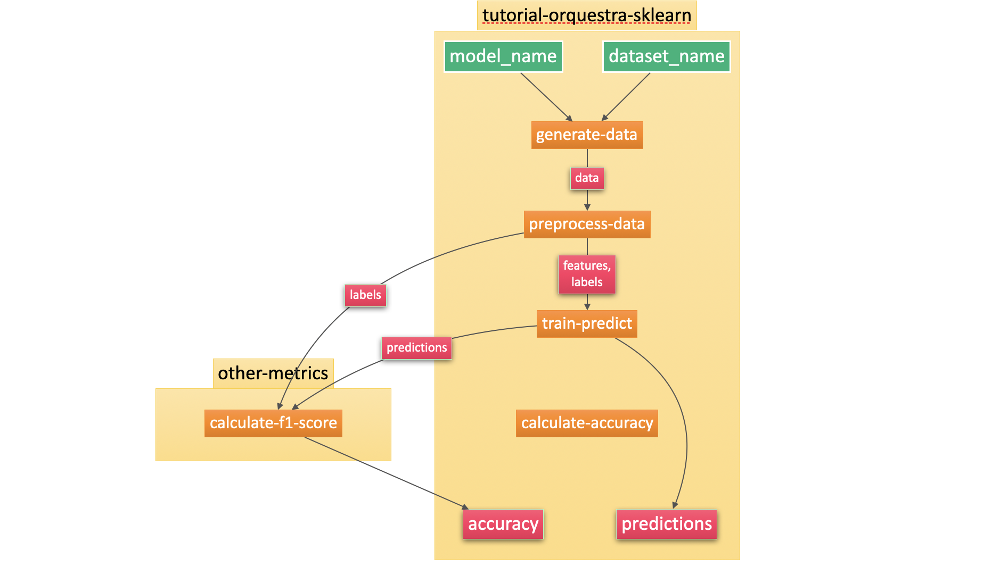

# Tutorial 3: Building a modular Orquestra workflow

Watch the [video](https://www.youtube.com/watch?v=HEqd4DfVMqY) describing this tutorial.


FEEDBACK: ALGO MAS CONCRETO SOBRE POR QUE ES BUENO TENER WORKFLOWS MODULARES

In tutorials 1 and 2 you learned how to build and run an Orquestra workflow with one task. In this tutorial you'll learn to exploit Orquestra's modularity, by building a workflow with more tasks.

The workflow that you built in tutorials 1 and 2 trained a machine learning model in a small dataset. The workflow runs a function called `generate_train_predict`. This function takes two inputs, the name of the dataset and the name of the model, and returns two outputs, the predictions and the accuracy of the model.

In particular, in the exercise in tutorial 1 you wrote a workflow template that ran 6 jobs in parallel, with the following inputs:

1. `dataset_name = "simple_dataset"`, `model_name = "perceptron"`.
2. `dataset_name = "simple_dataset"`, `model_name = "decision_tree"`.
3. `dataset_name = "simple_dataset"`, `model_name = "svm"`.
4. `dataset_name = "square_dataset"`, `model_name = "perceptron"`.
5. `dataset_name = "square_dataset"`, `model_name = "decision_tree"`.
6. `dataset_name = "square_dataset"`, `model_name = "svm"`.

However, if you look at it carefully, this is not ideal. We are running the `generate_train_predict`, which mainly does two things: generates the dataset and trains the model. However, we are generating each dataset 3 times. It is a small dataset, but imagine if the dataset was very large and it took a long time to generate, read, or process. Ideally we'd like to only do it once, and pass the result to the 3 models for training. This is what we'll do in this tutorial.

The main things we have to modify from the workflow from tutorials 1 and 2 are the following:

1. Turn the `tutorial_2_task.py` task into two tasks, one that generates and preprocesses the data, and one that trains the model, makes predictions, and finds the accuracy.
2. Modify the workflow template to run these two tasks in series, and to pass the output of the first task into the second task.


### 0. Preliminaries
FEEDBACK: FIX THE REPO LINK BELOW

The code for this tutorial is all in the [z-scikit-learn repo](http://www.github.com/zapatacomputing/z-sklearn) to follow. We recommend you to clone it to follow this tutorial, although if you'd like the extra challenge, you can make your own repo which will end up with this folder structure. If you use your own repo, make sure you change any references to `z-scikit-learn` to your repo.

```Bash
.
├── examples
│   └── tutorial-3-workflow.yaml
├── tasks
│   ├── tutorial_3_generate_data_task.py
│   └── tutorial_3_train_model_task.py
└── src
    ├── python
    │   └── tutorial
    │       ├── functions.py
    │       └── utils.py
    └── setup.py
```

### 1. Turning the task into two tasks

In tutorial 2 we wrote a workflow template to run the function `generate_train_predict` which lived in the `tutorial_2_task.py` file. Now, we split this function into two functions:
- `generate_preprocess_data`, which will generate the dataset and preprocess it as features and labels.
- `train_predict_accuracy_model`, which will train the model, make predictions, and calculate the accuracy.

Each function lives in its own task, as shown in the code below.
Pay special attention to the outputs of the functions, as they are serialized and saved as json files.

#### `tutorial_3_generate_data_task.py`
```python
from tutorial.functions import *
from tutorial.utils import save_json

def generate_preprocess_data(dataset_name):
    # Reading the data
    data = generate_dataset(dataset_name)

    # Processing the data
    features, labels = preprocess_data(data)

    # Saving the prediction and accuracy as results
    features_dict = {}
    features_dict['features'] = features
    save_json(features_dict, 'features.json')
    
    labels_dict = {}
    labels_dict['labels'] = labels
    save_json(labels_dict, 'labels.json')
```

#### `tutorial_3_train_model_task.py`
```python
from tutorial.functions import *
from tutorial.utils import save_json
from tutorial.utils import read_json

def train_predict_accuracy(features, labels, model_name):
    
    feat = read_json(features)['features']
    lab = read_json(labels)['labels']

    # Training the model
    model = train_model(feat, lab, model_name)
    
    # Making predictions
    predictions = make_predictions(model, feat)
    
    # Calculating the accuracy of the model
    accuracy = calculate_accuracy(predictions, lab)
    
    # Saving the prediction and accuracy as results
    result = {}
    result['predictions'] = predictions.tolist()
    result['accuracy'] = [accuracy]
    save_json(result, 'result.json')
```

Notice that we used a `save_json` and a `read_json` functions. These need to be added to `utils.py`, and here is the code for it:

#### `utils.py`
```python
import json
from json import JSONEncoder
import numpy as np

def save_json(result, filename) -> None:
    """
    Saves data as JSON.
    Args:
        result (ditc): of data to save.
        filenames (str): file name to save the data in
            (should have a '.json' extension).
    """
    try:
        with open(filename,'w') as f:
            result["schema"] = "orquestra-v1-data"
            f.write(json.dumps(result, indent=2, cls=NumpyArrayEncoder)) 

    except IOError:
        print(f'Error: Could not open {filename}')

def read_json(filename) -> dict:
    """
    Loads data from JSON.
    Args:
        filename (str): the file to load the data from.
    Returns:
        data (dict): data that was loaded from the file.
    """
    data = {}
    try:
        with open(filename, 'r') as f:
            data = json.load(f)
    except IOError:
            print(f'Error: Could not open {filename}')

    return data

class NumpyArrayEncoder(JSONEncoder):
    """
    Aux classes for decoding NumPy arrays to Python objects.
    Returns:
        A list or a JSONEnconder object.
    """
    def default(self, obj):
        if isinstance(obj, np.ndarray):
            return obj.tolist()
        return JSONEncoder.default(self, obj)

```

### 2. Adding a step to the workflow template
Now that we have two tasks, all we need is to modify the workflow to run two steps, one for each task. The first step is called `generate-data` and the second one `train-model`.

Pay special attention to the output of the first step. This task has two ouputs, `features` and `labels`, and they are both numpy arrays. We have created two classes to hold them, called `sk_features` and `sk_labels` (and we have declared them at the end of the workflow template).
```yaml
  outputs:
  - name: features
    type: np_features
  - name: labels
    type: np_labels
```

Next, we make sure that these tasks don't run in parallel, since `train-model` needs to run after `generate-data`. This is done with the following line of code:
```yaml
passed: [generate-data]
```

And finally, we send the features and labels as input to the train-model step, making sure we specified the type.
```yaml
  inputs:
    # We input the features and labels from the generate-data task
    - features: ((generate-data.features))
      type: np_features
    - labels: ((generate-data.labels))
      type: np_labels
    - model_name: "perceptron"
      type: string
```

The full template is here.

#### `tutorial-3-workflow.yaml`
```yaml
# Workflow API version
apiVersion: io.orquestra.workflow/1.0.0

# Prefix for workflow ID
name: tutorial-3

# List resources needed by workflow.
imports:
- name: sklearn-resource
  type: git
  parameters:
    repository: "git@github.com:zapatacomputing/z-scikit-learn.git"
    branch: "workflow-v1"

steps:

# This step generates and preprocesses the data
- name: generate-data
  config:
    runtime:
      type: python3
      imports: [sklearn-resource]
      parameters:
        file: sklearn-resource/tasks/tutorial_3_generate_data_task.py
        function: generate_preprocess_data
    resources:
      cpu: "1000m"
      memory: "1Gi"
      disk: "15Gi"
  inputs:
    - dataset_name: "simple_dataset"
      type: string
  # We create classes to hold the ouputs from this task, features and labels
  outputs:
  - name: features
    type: np_features
  - name: labels
    type: np_labels

# This step trains the model, makes predictions, and evaluates the model
- name: train-model
  # We specify that this task MUST run after the generate-data task
  passed: [generate-data]
  config:
    runtime:
      type: python3
      imports: [sklearn-resource]
      parameters:
        file: sklearn-resource/tasks/tutorial_3_train_model_task.py
        function: train_predict_accuracy_model
    resources:
      cpu: "1000m"
      memory: "1Gi"
      disk: "15Gi"
  inputs:
    # We input the features and labels from the generate-data task
    - features: ((generate-data.features))
      type: np_features
    - labels: ((generate-data.labels))
      type: np_labels
    - model_name: "perceptron"
      type: string
  outputs:
  - name: result
    type: output

types:
 - np_features
 - np_labels
 - output
```

### 3. Running the workflow
When we run this workflow in Orquestra, we can see the different steps and the output from each of them.

```Bash
>>>qe submit workflow examples/tutorial-3-workflow.yaml

Successfully submitted workflow to quantum engine!
Workflow ID: tutorial-3-a3975fd0-7c2a-4a98-b7a8-93b815550218

>>>qe get workflow tutorial-3-a3975fd0-7c2a-4a98-b7a8-93b815550218

Name:                tutorial-3-a3975fd0-7c2a-4a98-b7a8-93b815550218
Namespace:           default
Status:              Succeeded
Created:             Wed Sep 16 05:17:07 +0000 (48 seconds ago)
Started:             Wed Sep 16 05:17:07 +0000 (48 seconds ago)
Finished:            Wed Sep 16 05:17:29 +0000 (26 seconds ago)
Duration:            22 seconds
Parameters:          
  s3-bucket:         quantum-engine
  s3-key:            projects/v1

STEP                                                      PODNAME                                                     DURATION  MESSAGE
  tutorial-3-a3975fd0-7c2a-4a98-b7a8-93b815550218 (qeDagWorkflow)                                                                                         
 ├- generate-data (generate-data)                                  tutorial-3-a3975fd0-7c2a-4a98-b7a8-93b815550218-687926733   10s       features,labels  
 └- train-model (train-model)                                      tutorial-3-a3975fd0-7c2a-4a98-b7a8-93b815550218-2875426681  10s       result  
```

### 4. Exercise: Modularizing the template even more
In this tutorial we wrote a workflow consisting of two tasks:
- generate_preprocess_data: Generates the dataset and preprocesses it into features and labels.
- train_predict_accuracy: Trains the model, makes predictions, and finds the accuracy of the model.

In this exercise, you'll turn it into a workflow consisting of five tasks:
- generate_data: Generates the dataset.
- preprocess_data: Preprocesses the dataset into features and labels.
- train_predict: Trains the model and makes predictions.
- calculate_accuracy: Calculates the accuracy of the model in the dataset.

The outputs of this dataset are the predictions and the accuracy.


##### 4.1 Solution

```yaml
# Workflow API version
apiVersion: io.orquestra.workflow/1.0.0

# Prefix for workflow ID
name: tutorial-3-modular

# List resources needed by workflow.
imports:
- name: sklearn-resource
  type: git
  parameters:
    repository: "git@github.com:zapatacomputing/z-scikit-learn.git"
    branch: "workflow-v1"

steps:

# This step runs the task that generates the dataset 
- name: generate-data
  config:
    runtime:
      type: python3
      imports: [sklearn-resource]
      parameters:
        file: sklearn-resource/tasks/tutorial_3_exercise_task.py
        function: generate_data_task
    resources:
      cpu: "1000m"
      memory: "1Gi"
      disk: "15Gi"
  inputs:
    - dataset_name: "simple_dataset"
      type: string
  outputs:
  - name: data
    type: np_dataset

# This step runs the task that preprocesses the data
- name: preprocess-data
  passed: [generate-data]
  config:
    runtime:
      type: python3
      imports: [sklearn-resource]
      parameters:
        file: sklearn-resource/tasks/tutorial_3_exercise_task.py
        function: preprocess_data_task
    resources:
      cpu: "1000m"
      memory: "1Gi"
      disk: "15Gi"
  inputs:
    - data: ((generate-data.data))
      type: np_dataset
  outputs:
  - name: features
    type: np_features
  - name: labels
    type: np_labels

# This step runs the task that trains the model and makes the predictions
- name: train-predict
  passed: [preprocess-data]
  config:
    runtime:
      type: python3
      imports: [sklearn-resource]
      parameters:
        file: sklearn-resource/tasks/tutorial_3_exercise_task.py
        function: train_predict_task
    resources:
      cpu: "1000m"
      memory: "1Gi"
      disk: "15Gi"
  inputs:
    - model_name: "perceptron"
      type: string
    - features: ((preprocess-data.features))
      type: np_features
    - labels: ((preprocess-data.labels))
      type: np_labels
  outputs:
  - name: predictions
    type: np_predictions

# This step runs the task that calculates the accuracy of the model
- name: calculate-accuracy
  passed: [train-predict]
  config:
    runtime:
      type: python3
      imports: [sklearn-resource]
      parameters:
        file: sklearn-resource/tasks/tutorial_3_exercise_task.py
        function: calculate_accuracy_task
    resources:
      cpu: "1000m"
      memory: "1Gi"
      disk: "15Gi"
  inputs:
    - predictions: ((train-predict.predictions))
      type: np_predictions
    - labels: ((preprocess-data.labels))
      type: np_labels
  outputs:
  - name: accuracy
    type: output_accuracy
types:
 - np_dataset
 - np_features
 - np_labels
 - np_predictions
 - output_accuracy
 ```

 ### 5. Combining code from different components
 One of the greatest strengths of Orquestra is the ability to combine code from different sources. The code above all lives in the [www.github.com/zapatacomputing/z-scikit-learn](www.github.com/zapatacomputing/z-scikit-learn). Imagine the following scenario: You want to run this repo, but you don't want the model to calculate accuracy, instead, you'd like it to calculate any other metric, say, f1_score. You can write this function in another resource of your own and call it from the workflow template. Here is how to do this.



##### 5.1 Create the component

Create a repo on GitHub called `other-metrics` (or any name you'd like), with the following folder structure.

 ```
.
├── examples
│   └── other-metrics-workflow.yaml
├── tasks
│   └── f1_score_task.py
└── src
    ├── python
    │   └── tutorial
    │       ├── functions.py
    │       └── utils.py
    └── setup.py
 ```

In `functions.py`, write the function for calculating `f1_score`, and call this function in `f1_score_task.py` just as before.

##### `functions.py`

 ```python
from sklearn.metrics import f1_score

def calculate_f1_score(predictions, labels):
    f1 = f1_score(predictions, labels)
    return f1
 ```

##### `f1_score_task.py`
 ```python
from metrics.functions import calculate_f1_score
from metrics.utils import read_json, save_json

def calculate_f1_score_task(labels, predictions):
    lab = read_json(labels)['labels']
    pred = read_json(predictions)['predictions']

    f1_score = [calculate_f1_score(pred, lab)]

    f1_score_dict = {}
    f1_score_dict['f1_score'] = f1_score
    save_json(f1_score_dict, 'f1_score.json')
 ```

Don't forget to change the name of the repo in `setup.py`.

##### `setup.py`
 ```python
import setuptools

setuptools.setup(
    name                            = "tutorial-resource",
    description                     = "Other metrics for models in orquestra.",
    url                             = "https://github.com/<your-github-id>/other-metrics",
    packages                        = setuptools.find_packages(where = "python"),
    package_dir                     = {"" : "python"},
    classifiers                     = (
        "Programming Language :: Python :: 3",
        "Operating System :: OS Independent",
    ),
    install_requires = [
        "sklearn",
        "numpy",
   ],
)
 ```

And finally, the workflow should look like this. Notice that we are calling two different resources, `other-metrics` for calculating the f1-score and `z-scikit-learn` for all the other functions.

##### `other-metrics-workflow.yaml`

 ```python
# Workflow API version
apiVersion: io.orquestra.workflow/1.0.0

# Prefix for workflow ID
name: tutorial-3-modular

# List resources needed by workflow.
imports:
- name: sklearn-resource
  type: git
  parameters:
    repository: "git@github.com:zapatacomputing/z-scikit-learn.git"
    branch: "workflow-v1"
- name: other-metrics-resource
  type: git
  parameters:
    repository: "git@github.com:luisguiserrano/other-metrics.git"
    branch: "master"

steps:

# This step runs the task that generates the dataset 
- name: generate-data
  config:
    runtime:
      type: python3
      imports: [sklearn-resource]
      parameters:
        file: sklearn-resource/tasks/tutorial_3_exercise_task.py
        function: generate_data_task
    resources:
      cpu: "1000m"
      memory: "1Gi"
      disk: "15Gi"
  inputs:
    - dataset_name: "simple_dataset"
      type: string
  outputs:
  - name: data
    type: np_dataset

# This step runs the task that preprocesses the data
- name: preprocess-data
  passed: [generate-data]
  config:
    runtime:
      type: python3
      imports: [sklearn-resource]
      parameters:
        file: sklearn-resource/tasks/tutorial_3_exercise_task.py
        function: preprocess_data_task
    resources:
      cpu: "1000m"
      memory: "1Gi"
      disk: "15Gi"
  inputs:
    - data: ((generate-data.data))
      type: np_dataset
  outputs:
  - name: features
    type: np_features
  - name: labels
    type: np_labels

# This step runs the task that trains the model and makes the predictions
- name: train-predict
  passed: [preprocess-data]
  config:
    runtime:
      type: python3
      imports: [sklearn-resource]
      parameters:
        file: sklearn-resource/tasks/tutorial_3_exercise_task.py
        function: train_predict_task
    resources:
      cpu: "1000m"
      memory: "1Gi"
      disk: "15Gi"
  inputs:
    - model_name: "perceptron"
      type: string
    - features: ((preprocess-data.features))
      type: np_features
    - labels: ((preprocess-data.labels))
      type: np_labels
  outputs:
  - name: predictions
    type: np_predictions

# This step runs the task that calculates the f1-score of the model
- name: calculate-f1-score
  passed: [train-predict]
  config:
    runtime:
      type: python3
      imports: [other-metrics-resource]
      parameters:
        file: other-metrics-resource/tasks/f1_score_task.py
        function: calculate_f1_score_task
    resources:
      cpu: "1000m"
      memory: "1Gi"
      disk: "15Gi"
  inputs:
    - predictions: ((train-predict.predictions))
      type: np_predictions
    - labels: ((preprocess-data.labels))
      type: np_labels
  outputs:
  - name: f1_score
    type: output_f1score
types:
 - np_dataset
 - np_features
 - np_labels
 - np_predictions
 - output_f1score
 ```